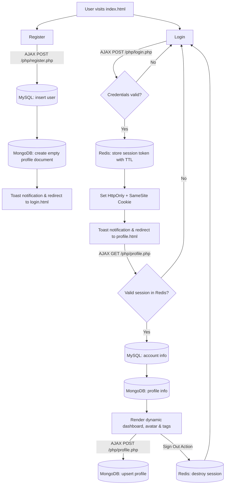

# NuraHub Auth — Registration / Login / Profile

A modern, high-performance authentication & profile management system built with **PHP 8** (backend JSON APIs), **jQuery/AJAX** (zero page reloads), **Tailwind CSS** (glassmorphic dark/light UI), **MySQL** (accounts & credentials), **MongoDB** (dynamic document profiles), and **Redis** (in-memory sliding TTL sessions).

## Key Features

- **Modern Glassmorphic UI**: Designed with Tailwind CSS, Lucide Icons, glowing ambient gradient meshes, and responsive layouts.
- **Asynchronous AJAX Pipeline**: Zero page reloads across all user journeys (Registration, Login, Profile Updates, and Logout).
- **Custom Toast Notification System**: Floating animated toasts with status colors (success, error, warning, info) and auto-dismiss progress timers.
- **Real-Time Password Strength Meter**: Live entropy evaluation assessing character variety, length, and strength with dynamic visual bars.
- **Interactive Interest Tag Pills**: Chip-based dynamic tag manager supporting rapid addition (Enter/comma) and one-click removal with instant serialization.
- **Dynamic Avatar Generator**: Automatically computes unique color gradients and initials based on user names.
- **Triad Database Architecture**:
  - **MySQL**: Relational user storage with `password_hash()` (Bcrypt) and parameterized PDO queries.
  - **MongoDB Atlas**: Dynamic document storage for polymorphic profile attributes (name, age, bio, interests array).
  - **Redis Cloud**: 1-hour sliding TTL session tokens with automatic native PHP session failover.

## Folder Structure

```
nurahub-auth/
├── assets/
├── css/
│   └── style.css            # Glassmorphism, animations, toast & tag styles
├── js/
│   ├── toast.js             # Reusable floating toast notification system
│   ├── register.js          # Live validation, strength gauge, AJAX register
│   ├── login.js             # Password toggle, loading state, AJAX login
│   └── profile.js           # Avatar generator, dynamic tags, AJAX update & logout
├── php/
│   ├── config.php           # DB connections (MySQL, MongoDB, Redis) & env loader
│   ├── session_helper.php   # Redis session token management & failover
│   ├── register.php         # Registration API endpoint (POST)
│   ├── login.php            # Login API endpoint (POST)
│   └── profile.php          # Profile API endpoint (GET / POST)
├── index.html               # Modern landing & architecture overview page
├── register.html            # User registration & onboarding page
├── login.html               # User authentication page
├── profile.html             # Profile & account dashboard
├── schema.sql               # MySQL table schema
├── composer.json            # PHP dependencies
└── .env.example             # Sample environment variables
```

## Setup & Local Development

1. **Install dependencies**
   ```bash
   composer install          # installs mongodb/mongodb
   ```

2. **Configure environment variables**
   ```bash
   cp .env.example .env
   # Edit .env with your MySQL, MongoDB Atlas URI, and Redis credentials
   ```

3. **Create MySQL database**
   ```bash
   mysql -u root -p < schema.sql
   ```

4. **Run local PHP development server**
   ```bash
   php -S localhost:8000
   ```
   Open `http://localhost:8000` in your web browser.

## Application Flow



## Security Specifications

- **Bcrypt Password Hashing**: Passwords are encrypted using PHP's native `password_hash()` with standard cost factors.
- **SQL Injection Prevention**: All queries use PDO prepared statements with strict parameter binding.
- **Session Protection**: Session cookies are configured with `HttpOnly` and `SameSite=Lax`.
- **Sliding Session Expiry**: Active authenticated requests automatically renew the 1-hour Redis TTL.
- **Client & Server-Side Input Validation**: Rigorous validation on both ends for email schemas, regex username patterns, integer ranges, and character limits.
