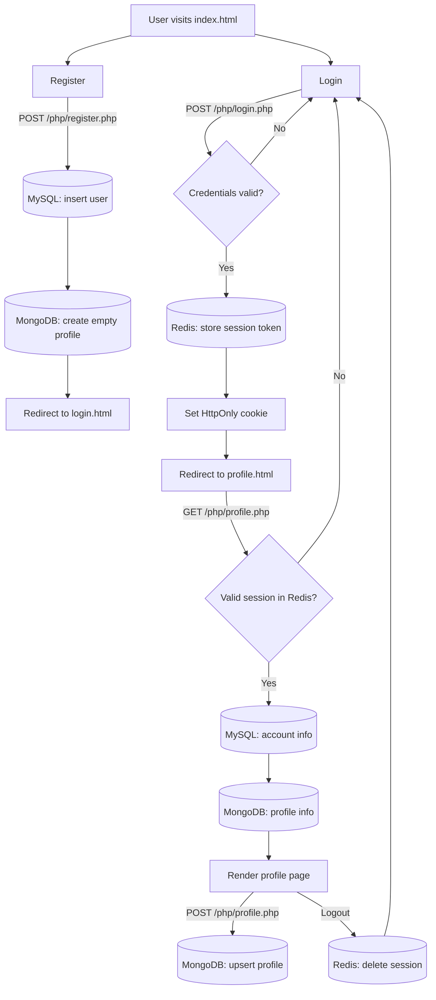
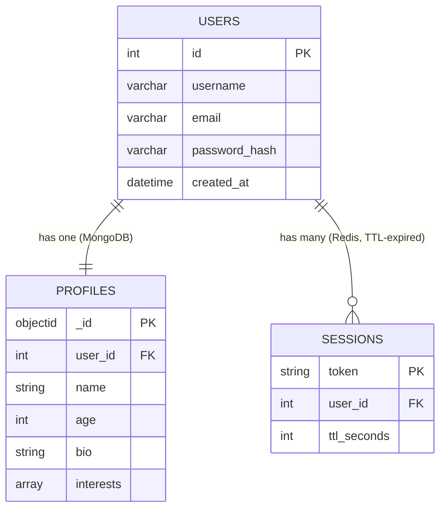

# NuraHub Auth — Registration / Login / Profile

An authentication system built with PHP (backend APIs), jQuery/AJAX (no page
reloads), MySQL (accounts), MongoDB (profile data), Redis (sessions), and
Bootstrap (responsive UI).

## Folder Structure

```
nurahub-auth/
├── assets/
├── css/
│   └── style.css
├── js/
│   ├── register.js
│   ├── login.js
│   └── profile.js
├── php/
│   ├── config.php
│   ├── session_helper.php
│   ├── register.php
│   ├── login.php
│   └── profile.php
├── index.html
├── register.html
├── login.html
├── profile.html
├── schema.sql
├── composer.json
└── .env.example
```

## Setup

1. **Install dependencies**
   ```bash
   composer install          # installs mongodb/mongodb
   ```
   Also enable the `redis` and `mongodb` PHP extensions
   (`pecl install redis mongodb`, then add both to `php.ini`).

2. **Create the MySQL database**
   ```bash
   mysql -u root -p < schema.sql
   ```

3. **Configure environment variables**
   ```bash
   cp .env.example .env
   # edit .env with your real DB_HOST, DB_USER, DB_PASS, MONGO_URI, REDIS_HOST, etc.
   ```

4. **Run locally**
   ```bash
   php -S localhost:8000
   ```
   Make sure MySQL, MongoDB, and Redis are running locally (or point the
   `.env` values at hosted instances).

5. **Deploy**
   Deploy to any PHP-capable host (Render, Railway, a VPS, etc.) with
   managed/hosted MySQL, MongoDB, and Redis, and set the same environment
   variables there instead of committing `.env`.

## Application Flow



## Database Schema



- **MySQL** `users` — account credentials (username, email, bcrypt password hash).
- **MongoDB** `profiles` — extended profile info (name, age, bio, interests), keyed by `user_id`.
- **Redis** `session:<token>` — maps a session token to a `user_id`, with a 1-hour TTL, used to keep users signed in.

## Security Notes

- Passwords are hashed with `password_hash()` (bcrypt) — never stored in plain text.
- All SQL queries use PDO prepared statements to prevent SQL injection.
- All user input is validated/sanitized server-side before storage.
- Session cookies are `HttpOnly` + `SameSite=Lax`; enable `secure` once served over HTTPS.
- Secrets (DB/Mongo/Redis credentials) are read from environment variables, never hard-coded.
